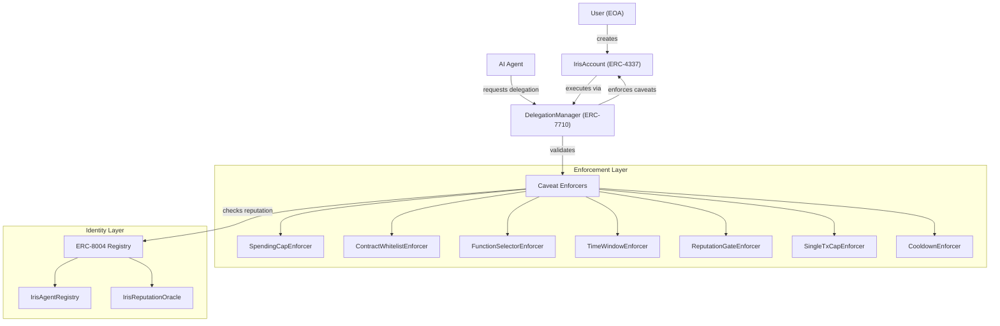
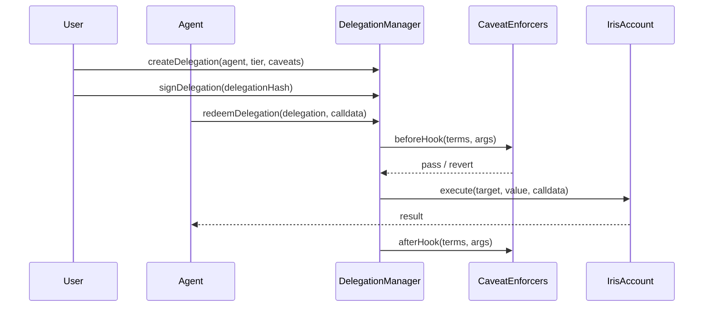

# Architecture

Iris Protocol is composed of four layers: accounts, delegations, enforcement, and identity. Each layer maps to a specific ERC standard and is independently auditable.

## System Overview



## Component Architecture

### Layer 1: Account (ERC-4337)

**IrisAccount** is an ERC-4337 smart contract account. It serves as the agent's wallet and the user's vault simultaneously. The account validates UserOperations, supports batch execution, and implements the delegation interface.

Key properties:
- Owned by the user's EOA
- Delegates specific permissions to agent addresses
- All state changes go through the EntryPoint
- Supports EIP-7702 upgrade path for EOAs

### Layer 2: Delegation (ERC-7710)

**DelegationManager** is the core orchestrator. When a user grants an agent a trust tier, the manager creates a delegation with an attached bundle of caveat enforcers. When the agent submits a transaction, the manager redeems the delegation, runs every enforcer, and either executes or reverts.

Delegation lifecycle:
1. **Create** -- User selects a trust tier; manager bundles the corresponding caveats
2. **Sign** -- User signs the delegation offchain (EIP-712)
3. **Store** -- Delegation stored onchain or offchain depending on configuration
4. **Redeem** -- Agent submits a transaction referencing the delegation
5. **Enforce** -- Each caveat enforcer runs its validation logic
6. **Execute** -- If all caveats pass, the transaction executes on the IrisAccount



### Layer 3: Enforcement (Caveat Enforcers)

Each caveat enforcer is an independent contract implementing a single validation rule. Enforcers run before and after execution, enabling both pre-checks (spending limits, reputation gates) and post-checks (state validations).

Enforcers are composable: a trust tier bundles multiple enforcers together. The delegation only succeeds if every enforcer passes.

See [Caveat Enforcers](./contracts/caveat-enforcers.md) for the full catalog.

### Layer 4: Identity (ERC-8004)

**ERC-8004** provides agent identity and reputation. Each agent mints an identity NFT, and the reputation oracle tracks their onchain behavior. The **ReputationGateEnforcer** queries this registry in real-time, blocking agents whose reputation drops below the required threshold.

See [Identity & Reputation](./identity.md) for details.

## Data Flow by Trust Tier

### Tier 0: View Only
```
Agent → reads public state only → no delegation needed
```

### Tier 1: Supervised
```
Agent → redeemDelegation → SpendingCapEnforcer(100/day)
                         → ContractWhitelistEnforcer(approved_list)
                         → ReputationGateEnforcer(min_score=50)
                         → execute (if all pass)
```

### Tier 2: Autonomous
```
Agent → redeemDelegation → SpendingCapEnforcer(1000/day)
                         → FunctionSelectorEnforcer(swap, transfer)
                         → CooldownEnforcer(5min between large txs)
                         → ReputationGateEnforcer(min_score=70)
                         → execute (if all pass)
```

### Tier 3: Full Delegation
```
Agent → redeemDelegation → ReputationGateEnforcer(min_score=90)
                         → execute (if reputation check passes)
```

## Design Principles

1. **No offchain policy** -- Every permission check executes onchain. There is no API server, no key custodian, no TEE.
2. **Composable enforcement** -- Enforcers are independent contracts. Mix and match to build custom permission profiles.
3. **Dynamic reputation** -- Agent permissions degrade in real-time based on onchain behavior, not static configurations.
4. **Instant revocation** -- Users can revoke all delegations in a single transaction.
5. **Standard compliance** -- Every component maps to an existing or emerging ERC standard.
