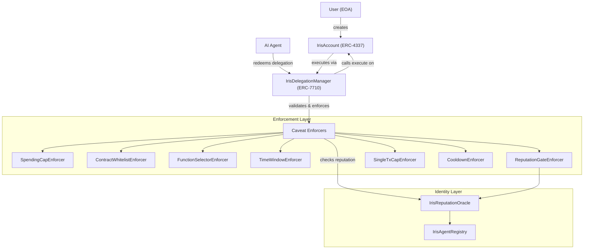
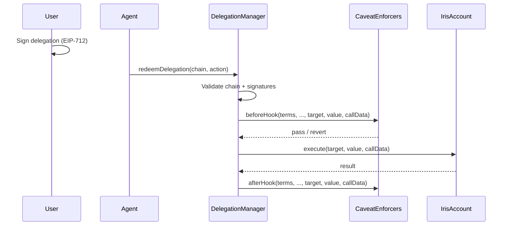

# Architecture

Iris Protocol is composed of four layers: accounts, delegations, enforcement, and identity. Each layer maps to a specific ERC standard and is independently auditable.

## System Overview



## Component Architecture

### Layer 1: Account (ERC-4337)

**IrisAccount** is an ERC-4337 smart contract account implementing IERC7710Delegator. It serves as the agent's wallet and the user's vault simultaneously. The account validates UserOperations, supports batch execution, and implements the delegation interface.

Key properties:
- Owned by the user's EOA
- Delegates execution to the authorized IrisDelegationManager
- Deterministic deployment via IrisAccountFactory (CREATE2)
- Supports EIP-7702 upgrade path for EOAs

### Layer 2: Delegation (ERC-7710)

**IrisDelegationManager** is the core orchestrator. Users sign delegations offchain with EIP-712. When an agent submits a transaction, the manager validates the delegation chain, verifies signatures, runs every caveat enforcer, and either executes or reverts.

Delegation lifecycle:
1. **Build** -- User selects a trust tier; preset library constructs the caveat array
2. **Sign** -- User signs the delegation offchain (EIP-712 typed data)
3. **Redeem** -- Agent submits a transaction referencing the delegation chain
4. **Enforce** -- Each caveat enforcer on **every delegation in the chain** runs its `beforeHook` validation (not just the leaf)
5. **Execute** -- If all caveats pass, the DelegationManager calls `execute()` on the IrisAccount
6. **Record** -- Each caveat enforcer runs its `afterHook` in reverse order (for state tracking like spend recording)

Security properties:
- **Reentrancy protection**: `redeemDelegation` is protected by OpenZeppelin's `ReentrancyGuard`
- **Full chain enforcement**: Caveats are enforced on ALL delegations in a chain, preventing bypass via intermediate delegations
- **Stateful enforcer protection**: `SpendingCapEnforcer` and `CooldownEnforcer` verify `msg.sender` is the authorized DelegationManager before mutating state
- **Authorized revocation**: `revokeDelegation` requires the full delegation struct and verifies the caller is the delegator or delegator's owner



### Layer 3: Enforcement (Caveat Enforcers)

Each caveat enforcer is an independent contract implementing a single validation rule. Enforcers run before and after execution, enabling both pre-checks (spending limits, reputation gates) and post-checks (state recording like cumulative spend).

Enforcers are composable: a trust tier bundles multiple enforcers together. The delegation only succeeds if every enforcer passes.

See [Caveat Enforcers](./contracts/caveat-enforcers.md) for the full catalog.

### Layer 4: Identity (ERC-8004)

**ERC-8004** provides agent identity and reputation. Each agent calls `registerAgent()` to get an agentId and identity NFT. The IrisReputationOracle tracks reputation scores (0-100) per agentId. The **ReputationGateEnforcer** queries this oracle in real-time, blocking agents whose reputation drops below the required threshold.

See [Identity & Reputation](./identity.md) for details.

## Data Flow by Trust Tier

### Tier 0: View Only
```
Agent -- reads public state only -- no delegation needed
```

### Tier 1: Supervised (4 caveats)
```
Agent -- redeemDelegation -- SpendingCapEnforcer (daily cap)
                           -- ContractWhitelistEnforcer (approved targets)
                           -- TimeWindowEnforcer (valid window)
                           -- ReputationGateEnforcer (min score)
                           -- execute (if all pass)
```

### Tier 2: Autonomous (5 caveats)
```
Agent -- redeemDelegation -- SpendingCapEnforcer (daily cap)
                           -- ContractWhitelistEnforcer (approved targets)
                           -- TimeWindowEnforcer (valid window)
                           -- ReputationGateEnforcer (min score)
                           -- SingleTxCapEnforcer (per-tx cap)
                           -- execute (if all pass)
```

### Tier 3: Full Delegation (6 caveats)
```
Agent -- redeemDelegation -- SpendingCapEnforcer (weekly cap)
                           -- ContractWhitelistEnforcer (approved targets)
                           -- TimeWindowEnforcer (valid window)
                           -- ReputationGateEnforcer (min score)
                           -- SingleTxCapEnforcer (per-tx cap)
                           -- CooldownEnforcer (delay between large txs)
                           -- execute (if all pass)
```

## Design Principles

1. **No offchain policy** -- Every permission check executes onchain. There is no API server, no key custodian, no TEE.
2. **Composable enforcement** -- Enforcers are independent contracts. Mix and match to build custom permission profiles.
3. **Dynamic reputation** -- Agent permissions degrade in real-time based on onchain behavior, not static configurations.
4. **Instant revocation** -- Users can revoke all delegations in a single transaction.
5. **Standard compliance** -- Every component maps to an existing or emerging ERC standard.
6. **Shared deployment fixture** -- `IrisDeployer.sol` is used by both deploy scripts and integration tests, guaranteeing tests exercise the exact same deployment path as production.
