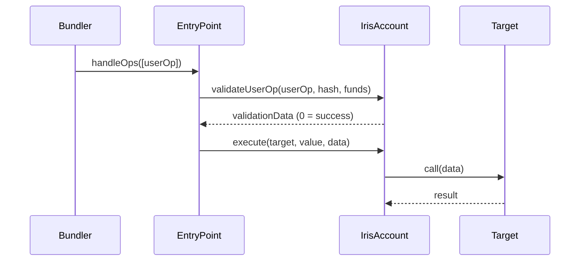

# IrisAccount

The core smart contract wallet implementing ERC-4337 (account abstraction) and the IERC7710Delegator interface. Each IrisAccount is owned by a user and can delegate scoped permissions to AI agents.

## Overview

IrisAccount serves two roles simultaneously:
1. **User's vault** -- holds assets, validates signatures, executes transactions
2. **Agent's wallet** -- agents execute transactions through delegations, not direct key access

## Interface

```solidity
/// @title IrisAccount
/// @notice ERC-4337 smart contract wallet with ERC-7710 delegation support
/// @dev Implements IERC7710Delegator

function execute(address target, uint256 value, bytes calldata data)
    external returns (bytes memory result);

function executeBatch(
    address[] calldata targets,
    uint256[] calldata values,
    bytes[] calldata calldatas
) external returns (bytes[] memory results);

function validateUserOp(
    PackedUserOperation calldata userOp,
    bytes32 userOpHash,
    uint256 missingAccountFunds
) external returns (uint256 validationData);

function isDelegationValid(bytes32 delegationHash)
    external view returns (bool);

function revokeDelegation(bytes32 delegationHash) external;

function setDelegationManager(address _delegationManager) external;

function owner() external view returns (address);

function delegationManager() external view returns (address);
```

## Events

```solidity
/// @notice Emitted when the delegation manager is updated
event DelegationManagerSet(address indexed oldManager, address indexed newManager);

/// @notice Emitted when a delegation is revoked
event DelegationRevoked(bytes32 indexed delegationHash);
```

## Access Control

```solidity
/// @notice Restricts function to the account owner
modifier onlyOwner();

/// @notice Restricts function to the owner or the authorized DelegationManager
modifier onlyOwnerOrDelegationManager();
```

- `execute()` and `executeBatch()` -- owner or DelegationManager
- `revokeDelegation()` and `setDelegationManager()` -- owner only
- `isDelegationValid()` -- public view

## How It Works

### ERC-4337 Integration

IrisAccount validates UserOperation signatures against the owner's address. All state-changing operations can go through the ERC-4337 **EntryPoint**:



### ERC-7710 Delegation

When an agent redeems a delegation, the IrisDelegationManager calls `execute()` on the IrisAccount. The account verifies that the caller is the authorized DelegationManager before executing.

```solidity
function execute(address target, uint256 value, bytes calldata data)
    external
    onlyOwnerOrDelegationManager
    returns (bytes memory result)
{
    bool success;
    (success, result) = target.call{value: value}(data);
    if (!success) revert ExecutionFailed();
}
```

### Account Factory

IrisAccount instances are deployed via `IrisAccountFactory` using CREATE2 for deterministic addresses:

```solidity
/// @notice Deploy a new IrisAccount
/// @param owner The account owner
/// @param delegationManager The authorized DelegationManager address
/// @param salt Unique salt for CREATE2
/// @return account The deployed account address
function createAccount(
    address owner,
    address delegationManager,
    uint256 salt
) external returns (address account);

/// @notice Compute the address of an account before deployment
function getAddress(
    address owner,
    address delegationManager,
    uint256 salt
) external view returns (address predicted);
```

## Usage Examples

### Deploying an Account

```solidity
// Deploy a new IrisAccount for a user
address account = factory.createAccount(
    userAddress,
    address(delegationManager),
    0  // salt
);

// The account address is deterministic
address predicted = factory.getAddress(userAddress, address(delegationManager), 0);
assert(account == predicted);
```

### Direct Execution (Owner)

```solidity
// Owner executes directly
IrisAccount(account).execute(
    uniswapRouter,
    0,
    abi.encodeCall(ISwapRouter.exactInputSingle, (params))
);
```

### Delegated Execution (Agent)

```solidity
// Agent redeems delegation (goes through DelegationManager)
Delegation[] memory chain = new Delegation[](1);
chain[0] = signedDelegation;

delegationManager.redeemDelegation(chain, Action({
    target: uniswapRouter,
    value: 0,
    callData: abi.encodeCall(ISwapRouter.exactInputSingle, (params))
}));
// DelegationManager calls account.execute() after enforcing all caveats
```

## Security Considerations

- Only the owner or the authorized DelegationManager can call `execute()`
- `validateUserOp` is restricted to the canonical ERC-4337 v0.7 EntryPoint (`0x0000000071727De22E5E9d8BAf0edAc6f37da032`), preventing ETH drain via `missingAccountFunds`
- Delegated execution always goes through the DelegationManager, which enforces all attached caveats
- The account cannot be reinitialized after deployment (constructor-based, not initializer)
- The DelegationManager address can be updated by the owner via `setDelegationManager()`
- The account supports receiving ETH via `receive()`
