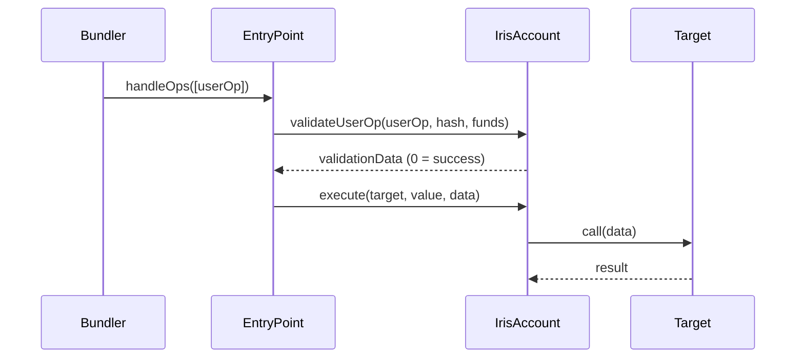

# IrisAccount

The core smart contract wallet implementing ERC-4337 (account abstraction) and the ERC-7710 delegation interface. Each IrisAccount is owned by a user and can delegate scoped permissions to AI agents.

## Overview

IrisAccount serves two roles simultaneously:
1. **User's vault** -- holds assets, validates signatures, executes transactions
2. **Agent's wallet** -- agents execute transactions through delegations, not direct key access

## Interface

```solidity
/// @title IrisAccount
/// @notice ERC-4337 smart contract wallet with ERC-7710 delegation support
/// @dev Implements IAccount, IERC7710Delegatable
interface IIrisAccount {
    /// @notice Execute a call from the account
    /// @param target The target contract address
    /// @param value The ETH value to send
    /// @param data The calldata to execute
    function execute(address target, uint256 value, bytes calldata data) external;

    /// @notice Execute a batch of calls from the account
    /// @param targets Array of target contract addresses
    /// @param values Array of ETH values
    /// @param datas Array of calldata
    function executeBatch(
        address[] calldata targets,
        uint256[] calldata values,
        bytes[] calldata datas
    ) external;

    /// @notice Validate a UserOperation per ERC-4337
    /// @param userOp The UserOperation to validate
    /// @param userOpHash The hash of the UserOperation
    /// @param missingAccountFunds Funds the account must send to the EntryPoint
    /// @return validationData 0 for success, 1 for failure
    function validateUserOp(
        PackedUserOperation calldata userOp,
        bytes32 userOpHash,
        uint256 missingAccountFunds
    ) external returns (uint256 validationData);

    /// @notice Check if a delegation is valid for this account
    /// @param delegation The delegation to validate
    /// @return True if the delegation is valid
    function isDelegationValid(
        Delegation calldata delegation
    ) external view returns (bool);

    /// @notice Get the account owner
    /// @return The owner address
    function owner() external view returns (address);

    /// @notice Transfer ownership of the account
    /// @param newOwner The new owner address
    function transferOwnership(address newOwner) external;
}
```

## Events

```solidity
/// @notice Emitted when a transaction is executed
event Executed(address indexed target, uint256 value, bytes data);

/// @notice Emitted when a batch transaction is executed
event BatchExecuted(address[] targets, uint256[] values);

/// @notice Emitted when ownership is transferred
event OwnershipTransferred(address indexed previousOwner, address indexed newOwner);

/// @notice Emitted when the account is initialized
event AccountInitialized(address indexed owner, address indexed entryPoint);
```

## Modifiers

```solidity
/// @notice Restricts function to the account owner or EntryPoint
modifier onlyOwnerOrEntryPoint();

/// @notice Restricts function to the DelegationManager
modifier onlyDelegationManager();

/// @notice Restricts function to the account itself (for internal calls)
modifier onlySelf();
```

## How It Works

### ERC-4337 Integration

IrisAccount implements the `IAccount` interface from ERC-4337. All state-changing operations go through the **EntryPoint** contract:



### ERC-7710 Delegation

When an agent redeems a delegation, the DelegationManager calls `execute()` on the IrisAccount. The account verifies that the caller is the authorized DelegationManager before executing.

```solidity
function execute(
    address target,
    uint256 value,
    bytes calldata data
) external onlyOwnerOrEntryPoint {
    (bool success, bytes memory result) = target.call{value: value}(data);
    require(success, "IrisAccount: execution failed");
    emit Executed(target, value, data);
}
```

### Account Factory

IrisAccount instances are deployed via `IrisAccountFactory` using CREATE2 for deterministic addresses:

```solidity
/// @notice Deploy a new IrisAccount
/// @param owner The account owner
/// @param salt Unique salt for CREATE2
/// @return account The deployed account address
function createAccount(
    address owner,
    uint256 salt
) external returns (IrisAccount account);

/// @notice Compute the address of an account before deployment
/// @param owner The account owner
/// @param salt Unique salt for CREATE2
/// @return The predicted account address
function getAddress(
    address owner,
    uint256 salt
) external view returns (address);
```

## Usage Examples

### Deploying an Account

```solidity
// Deploy a new IrisAccount for a user
IrisAccount account = factory.createAccount(userAddress, 0);

// The account address is deterministic
address predicted = factory.getAddress(userAddress, 0);
assert(address(account) == predicted);
```

### Direct Execution (Owner)

```solidity
// Owner executes directly
account.execute(
    uniswapRouter,
    0,
    abi.encodeCall(ISwapRouter.exactInputSingle, (params))
);
```

### Delegated Execution (Agent)

```solidity
// Agent redeems delegation (goes through DelegationManager)
delegationManager.redeemDelegation(
    delegation,
    abi.encodeCall(ISwapRouter.exactInputSingle, (params))
);
// DelegationManager calls account.execute() after enforcing caveats
```

## Security Considerations

- Only the owner or EntryPoint can call `execute()` directly
- Delegated execution always goes through the DelegationManager, which enforces all attached caveats
- The account cannot be reinitialized after deployment
- Ownership transfer requires the current owner's signature
- The account supports receiving ETH and ERC-721/ERC-1155 tokens
