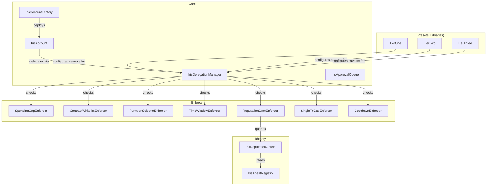

# Contract Overview

All Iris Protocol contracts target **Base Sepolia** testnet. The protocol consists of core account contracts, a delegation manager, caveat enforcers, identity/reputation contracts, an approval queue, and tier preset libraries.

## Contract Map



## Deployment Addresses (Base Sepolia)

| Contract | Address |
|----------|---------|
| IrisDelegationManager | `TBD` |
| IrisAccountFactory | `TBD` |
| IrisAgentRegistry | `TBD` |
| IrisReputationOracle | `TBD` |
| SpendingCapEnforcer | `TBD` |
| ContractWhitelistEnforcer | `TBD` |
| FunctionSelectorEnforcer | `TBD` |
| TimeWindowEnforcer | `TBD` |
| SingleTxCapEnforcer | `TBD` |
| CooldownEnforcer | `TBD` |
| ReputationGateEnforcer | `TBD` |
| IrisApprovalQueue | `TBD` |

Note: Tier presets (TierOne, TierTwo, TierThree) are Solidity libraries, not deployed contracts.

## Contract Descriptions

### Core

| Contract | Description |
|----------|-------------|
| **IrisAccount** | ERC-4337 smart contract wallet implementing IERC7710Delegator. Owned by a user, executes calls from the owner or authorized IrisDelegationManager. |
| **IrisAccountFactory** | CREATE2 factory for IrisAccount instances. Deterministic addresses from owner + delegationManager + salt. |
| **IrisDelegationManager** | ERC-7710 delegation lifecycle manager. Validates delegation chains, verifies EIP-712 signatures, runs caveat enforcer hooks on **all** delegations in the chain, and executes actions on delegator accounts. Protected by reentrancy guard. |
| **IrisApprovalQueue** | Queue for agent transactions exceeding delegation limits. Agents submit requests; delegators approve or reject. Requests expire after configurable duration (default 24 hours). |

### Enforcers

| Contract | Description |
|----------|-------------|
| **SpendingCapEnforcer** | Cumulative spending limits over rolling periods (daily, weekly). Tracks spend per delegation per period. State mutation restricted to authorized DelegationManager. |
| **ContractWhitelistEnforcer** | Restricts delegated calls to approved target contract addresses. |
| **FunctionSelectorEnforcer** | Restricts delegated calls to approved function selectors. |
| **TimeWindowEnforcer** | Limits delegation validity to a time range (notBefore, notAfter). |
| **ReputationGateEnforcer** | Queries `getReputationScore(uint256 agentId)` in real-time. Blocks execution if score < threshold. Enables dynamic, reputation-based access control. |
| **SingleTxCapEnforcer** | Caps maximum ETH value per individual transaction. |
| **CooldownEnforcer** | Minimum time interval between transactions exceeding a value threshold. Low-value transactions bypass cooldown. State mutation restricted to authorized DelegationManager. |

### Identity

| Contract | Description |
|----------|-------------|
| **IrisAgentRegistry** | ERC-8004 identity registry. Agents call `registerAgent()` to get an agentId and lightweight identity NFT. |
| **IrisReputationOracle** | Reputation scores (0-100) per agentId. Ownable for bootstrapping. +2 positive, -5 negative. Default: 50. |

### Presets (Libraries)

| Library | Caveats | Description |
|---------|---------|-------------|
| **TierOne** | 4 | Supervised: SpendingCap (daily), ContractWhitelist, TimeWindow, ReputationGate |
| **TierTwo** | 5 | Autonomous: SpendingCap (daily), ContractWhitelist, TimeWindow, ReputationGate, SingleTxCap |
| **TierThree** | 6 | Full Delegation: SpendingCap (weekly), ContractWhitelist, TimeWindow, ReputationGate, SingleTxCap, Cooldown |

## Interaction Patterns

### Creating a Delegation

Delegations are created offchain by signing an EIP-712 typed struct, then redeemed onchain by the delegate.

```solidity
// Build caveat array using a tier preset library
Caveat[] memory caveats = TierOne.configureTierOne(
    spendingCapEnforcer, whitelistEnforcer, timeWindowEnforcer,
    reputationGateEnforcer, reputationOracle, agentId,
    dailyCap, allowedContracts, validUntil, minReputation
);

// Construct and sign delegation (EIP-712)
Delegation memory del = Delegation({
    delegator: address(account),
    delegate: agentAddress,
    authority: address(0),
    caveats: caveats,
    salt: 1,
    signature: ""
});
bytes32 hash = delegationManager.getDelegationHash(del);
(uint8 v, bytes32 r, bytes32 s) = vm.sign(ownerKey, hash);
del.signature = abi.encodePacked(r, s, v);
```

### Redeeming a Delegation

```solidity
// Agent redeems delegation to execute an action
Delegation[] memory chain = new Delegation[](1);
chain[0] = signedDelegation;

delegationManager.redeemDelegation(chain, Action({
    target: targetContract,
    value: 1 ether,
    callData: abi.encodeCall(Target.doWork, (42))
}));
```

### Revoking a Delegation

```solidity
// Via DelegationManager (caller must be the delegator or delegator's owner)
delegationManager.revokeDelegation(delegation);

// Via IrisAccount (owner only, by delegation hash)
account.revokeDelegation(delegationHash);
```
