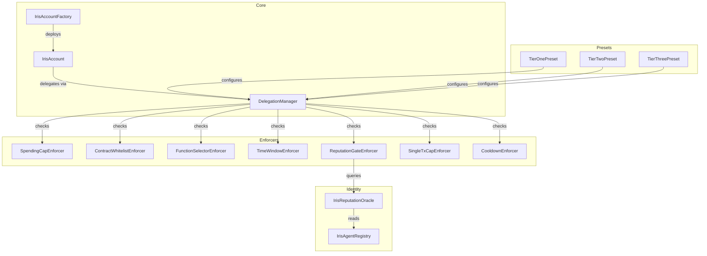

# Contract Overview

All Iris Protocol contracts are deployed on **Base Sepolia** testnet. The protocol consists of core account contracts, a delegation manager, caveat enforcers, and identity/reputation contracts.

## Contract Map



## Deployment Addresses (Base Sepolia)

| Contract | Address |
|----------|---------|
| IrisAccount (Implementation) | `TBD` |
| IrisAccountFactory | `TBD` |
| DelegationManager | `TBD` |
| SpendingCapEnforcer | `TBD` |
| ContractWhitelistEnforcer | `TBD` |
| FunctionSelectorEnforcer | `TBD` |
| TimeWindowEnforcer | `TBD` |
| ReputationGateEnforcer | `TBD` |
| SingleTxCapEnforcer | `TBD` |
| CooldownEnforcer | `TBD` |
| IrisAgentRegistry | `TBD` |
| IrisReputationOracle | `TBD` |
| TierOnePreset | `TBD` |
| TierTwoPreset | `TBD` |
| TierThreePreset | `TBD` |

## Contract Descriptions

### Core

| Contract | Description |
|----------|-------------|
| **IrisAccount** | ERC-4337 smart contract wallet. The agent's wallet and the user's vault. Validates UserOperations and executes delegated calls. |
| **IrisAccountFactory** | Deterministic deployment factory for IrisAccount instances. Uses CREATE2 for predictable addresses. |
| **DelegationManager** | Orchestrates the delegation lifecycle. Creates, stores, redeems, and enforces delegations per ERC-7710. |

### Enforcers

| Contract | Description |
|----------|-------------|
| **SpendingCapEnforcer** | Enforces daily, weekly, or monthly spending limits on delegations. |
| **ContractWhitelistEnforcer** | Restricts delegated calls to an approved set of target contract addresses. |
| **FunctionSelectorEnforcer** | Restricts delegated calls to an approved set of function selectors. |
| **TimeWindowEnforcer** | Limits delegation validity to a specific time range. |
| **ReputationGateEnforcer** | Queries ERC-8004 reputation in real-time. Blocks execution if agent score is below threshold. **Novel contribution.** |
| **SingleTxCapEnforcer** | Caps the maximum ETH value per individual transaction. |
| **CooldownEnforcer** | Enforces a minimum time interval between transactions exceeding a value threshold. |

### Identity

| Contract | Description |
|----------|-------------|
| **IrisAgentRegistry** | ERC-8004 identity registry. Agents mint an identity NFT to participate in the protocol. |
| **IrisReputationOracle** | Tracks and reports agent reputation scores. Queried by ReputationGateEnforcer. |

### Presets

| Contract | Description |
|----------|-------------|
| **TierOnePreset** | Bundles enforcers for Tier 1 (Supervised) delegations. |
| **TierTwoPreset** | Bundles enforcers for Tier 2 (Autonomous) delegations. |
| **TierThreePreset** | Bundles enforcers for Tier 3 (Full Delegation) delegations. |

## Interaction Patterns

### Creating a Delegation

```solidity
// User creates a Tier 1 delegation for an agent
TierOnePreset.createDelegation(
    delegationManager,
    agentAddress,
    approvedContracts,
    allowedSelectors
);
```

### Redeeming a Delegation

```solidity
// Agent redeems delegation to execute a swap
delegationManager.redeemDelegation(
    delegation,
    abi.encodeCall(ISwapRouter.swap, (params))
);
```

### Revoking All Delegations

```solidity
// User revokes all delegations instantly
delegationManager.revokeDelegation(delegationHash);
```
