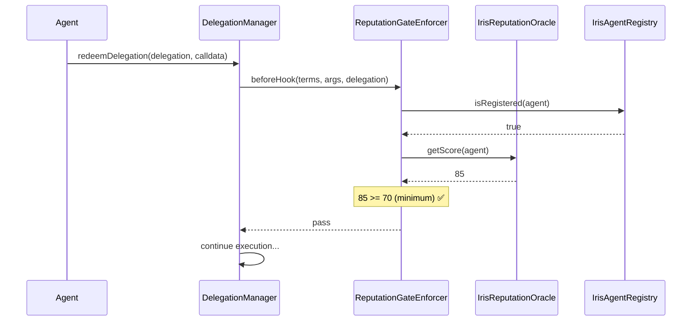
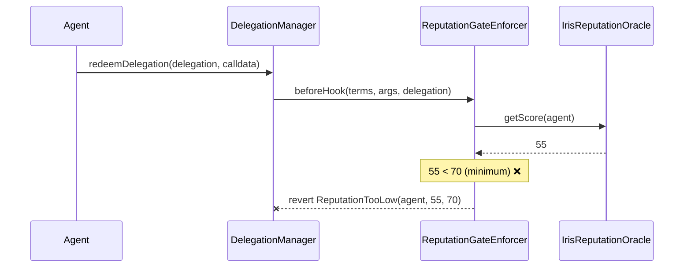

# ReputationGateEnforcer

**The novel contribution of Iris Protocol.** No one has built a caveat enforcer that gates delegated execution on real-time onchain reputation before. This contract is the bridge between ERC-7710 delegations and ERC-8004 agent identity.

## Why This Is Novel

Existing delegation frameworks (like MetaMask's DelegationFramework) support caveat enforcers for spending limits, time windows, and contract whitelists. These are **static** constraints -- they are configured once and do not change based on the agent's behavior.

ReputationGateEnforcer introduces **dynamic** constraints. The agent's reputation score is a living value that changes based on onchain behavior. This means:

- An agent granted Tier 3 access can be **automatically downgraded** if their reputation drops
- A single bad action can cascade across all delegations network-wide
- The system is self-healing: no admin intervention required to revoke a misbehaving agent

This is the **network-level immune system** for AI agent wallets.

## How It Works



When reputation is insufficient:



## Contract Implementation

```solidity
/// @title ReputationGateEnforcer
/// @notice Gates delegated execution on real-time ERC-8004 reputation scores
/// @dev Queries IrisReputationOracle on every beforeHook call
contract ReputationGateEnforcer is ICaveatEnforcer {

    /// @notice Emitted when an agent is blocked due to low reputation
    event ReputationCheckFailed(
        address indexed agent,
        uint256 score,
        uint256 required
    );

    /// @notice Emitted when an agent passes a reputation check
    event ReputationCheckPassed(
        address indexed agent,
        uint256 score,
        uint256 required
    );

    error ReputationTooLow(address agent, uint256 score, uint256 required);
    error AgentNotRegistered(address agent);

    /// @notice Called before delegated execution
    /// @dev Queries reputation oracle and reverts if score is below threshold
    function beforeHook(
        bytes calldata terms,
        bytes calldata args,
        Delegation calldata delegation
    ) external override {
        ReputationGateTerms memory t = abi.decode(terms, (ReputationGateTerms));

        // Verify agent is registered in ERC-8004
        address agent = delegation.delegate;
        if (!IIrisAgentRegistry(t.agentRegistry).isRegistered(agent)) {
            revert AgentNotRegistered(agent);
        }

        // Query live reputation score
        uint256 score = IIrisReputationOracle(t.reputationOracle).getScore(agent);

        // Gate on minimum score
        if (score < t.minimumScore) {
            emit ReputationCheckFailed(agent, score, t.minimumScore);
            revert ReputationTooLow(agent, score, t.minimumScore);
        }

        emit ReputationCheckPassed(agent, score, t.minimumScore);
    }

    /// @notice No-op after hook
    function afterHook(
        bytes calldata,
        bytes calldata,
        Delegation calldata
    ) external override {}
}
```

## The Dynamic Permission Degradation Model

Traditional permission systems are binary: you have access or you don't. Iris introduces a **gradient** model where access degrades smoothly as reputation changes.

```
Reputation Score: 100 ──────────────────── 0
                   │                       │
Tier 3 (min 90):   ████░░░░░░░░░░░░░░░░░░
Tier 2 (min 70):   ████████████░░░░░░░░░░
Tier 1 (min 50):   ████████████████████░░
Tier 0 (no min):   ████████████████████████
```

An agent with a score of 85:
- Can redeem Tier 1 delegations (85 >= 50)
- Can redeem Tier 2 delegations (85 >= 70)
- **Cannot** redeem Tier 3 delegations (85 < 90)

If that agent's score drops to 60:
- Can redeem Tier 1 delegations (60 >= 50)
- **Cannot** redeem Tier 2 delegations (60 < 70)
- **Cannot** redeem Tier 3 delegations (60 < 90)

No one needs to revoke the delegation. The enforcer handles it automatically at execution time.

## Network-Level Immune System

The reputation system acts as an immune system for the entire network:

1. **Detection** -- The IrisReputationOracle detects bad behavior (failed transactions, slashing events, community reports)
2. **Response** -- The agent's reputation score decreases
3. **Containment** -- Every ReputationGateEnforcer across every delegation checks the updated score
4. **Isolation** -- The agent loses access to all wallets that require a reputation above their new score
5. **Recovery** -- The agent can rebuild reputation through good behavior over time

This happens without any central authority, without any admin key, without any governance vote. The math enforces the policy.

## Integration Guide

### Step 1: Deploy the Enforcer

```solidity
ReputationGateEnforcer enforcer = new ReputationGateEnforcer();
```

### Step 2: Configure Terms

```solidity
bytes memory terms = abi.encode(ReputationGateTerms({
    reputationOracle: address(reputationOracle),
    minimumScore: 70,
    agentRegistry: address(agentRegistry)
}));
```

### Step 3: Attach to a Delegation

```solidity
Caveat[] memory caveats = new Caveat[](1);
caveats[0] = Caveat({
    enforcer: address(enforcer),
    terms: terms
});

Delegation memory delegation = Delegation({
    delegator: userAccount,
    delegate: agentAddress,
    caveats: caveats,
    // ... other fields
});
```

### Step 4: The Enforcer Runs Automatically

When the agent redeems the delegation, the DelegationManager automatically calls `beforeHook()` on the ReputationGateEnforcer. No additional integration needed.

## Combining with Other Enforcers

ReputationGateEnforcer is designed to compose with all other enforcers. A typical Tier 2 delegation bundles it alongside spending caps and function restrictions:

```solidity
Caveat[] memory caveats = new Caveat[](4);
caveats[0] = Caveat({enforcer: spendingCapEnforcer, terms: spendingTerms});
caveats[1] = Caveat({enforcer: functionSelectorEnforcer, terms: selectorTerms});
caveats[2] = Caveat({enforcer: cooldownEnforcer, terms: cooldownTerms});
caveats[3] = Caveat({enforcer: reputationGateEnforcer, terms: reputationTerms});
```

All enforcers must pass for the delegation to execute. The ReputationGateEnforcer adds a dynamic layer on top of the static constraints.
