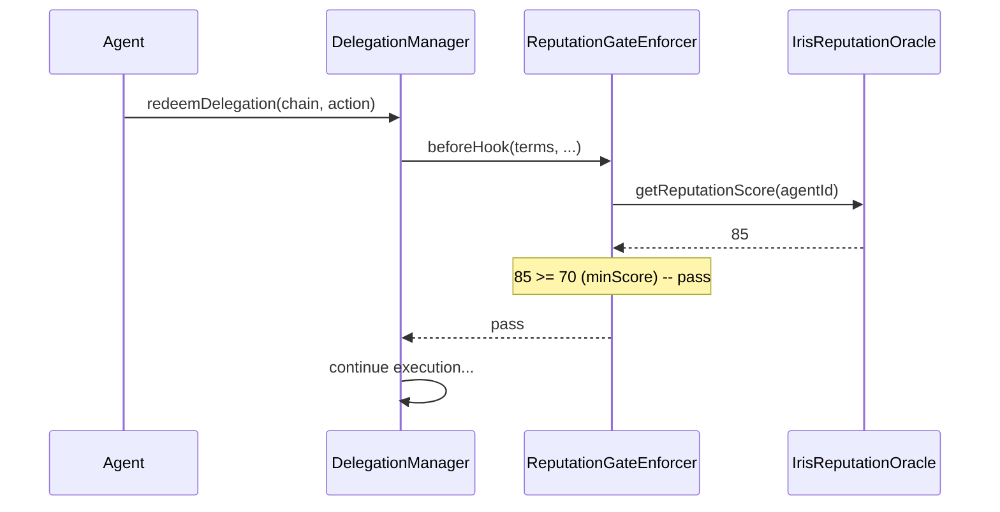
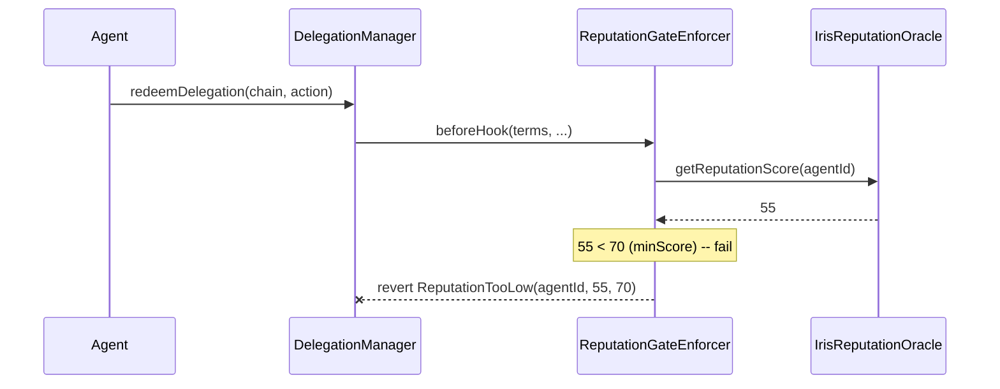

# ReputationGateEnforcer

Gates delegated execution on real-time ERC-8004 reputation scores, blocking agents whose onchain reputation drops below a configurable threshold.

**The first caveat enforcer to gate delegated execution on real-time onchain reputation.** This contract is the bridge between ERC-7710 delegations and ERC-8004 agent identity.

## Why This Is Novel

Existing delegation frameworks (like MetaMask's DelegationFramework) support caveat enforcers for spending limits, time windows, and contract whitelists. These are **static** constraints -- they are configured once and do not change based on the agent's behavior.

ReputationGateEnforcer introduces **dynamic** constraints. The agent's reputation score is a living value that changes based on onchain behavior. This means:

- An agent granted a delegation can be **automatically blocked** if their reputation drops
- A single bad action can cascade across all delegations network-wide
- The system is self-healing: no admin intervention required to restrict a misbehaving agent

This is the **network-level immune system** for AI agent wallets.

## How It Works



When reputation is insufficient:



## Contract Implementation

```solidity
/// @title ReputationGateEnforcer
/// @notice Gates delegated executions behind a minimum on-chain reputation score
/// @dev Stateless: no storage, single instance serves all delegations
contract ReputationGateEnforcer is ICaveatEnforcer {

    error ReputationTooLow(uint256 agentId, uint256 currentScore, uint256 requiredScore);
    error InvalidTerms();

    /// @notice Queries the ERC-8004 Reputation Registry and reverts if below threshold
    /// @param terms ABI-encoded (address reputationOracle, uint256 agentId, uint256 minScore)
    function beforeHook(
        bytes calldata terms,
        bytes calldata args,
        address delegationManager,
        bytes32 delegationHash,
        address delegator,
        address redeemer,
        address target,
        uint256 value,
        bytes calldata callData
    ) external view override {
        (address reputationOracle, uint256 agentId, uint256 minScore) =
            abi.decode(terms, (address, uint256, uint256));

        if (reputationOracle == address(0)) revert InvalidTerms();

        // Query the agent's live reputation score via staticcall
        uint256 currentScore = _queryReputation(reputationOracle, agentId);

        if (currentScore < minScore) {
            revert ReputationTooLow(agentId, currentScore, minScore);
        }
    }

    /// @notice No-op after hook -- reputation is a pre-condition, not a post-condition
    function afterHook(...) external pure override {}

    function _queryReputation(address oracle, uint256 agentId)
        internal view returns (uint256 score)
    {
        (bool success, bytes memory data) =
            oracle.staticcall(abi.encodeWithSignature("getReputationScore(uint256)", agentId));
        if (!success || data.length < 32) revert InvalidTerms();
        score = abi.decode(data, (uint256));
    }
}
```

### Key Design Decisions

1. **Oracle address in `terms`**: A single enforcer deployment serves multiple reputation registries (e.g. per-domain oracles)
2. **agentId-based lookup**: Uses the ERC-8004 identity token ID, not the agent's address, enabling identity portability
3. **staticcall**: The reputation check is a pure read with no side-effects, keeping gas minimal
4. **Stateless**: The enforcer holds no mappings and writes no storage, so it can be shared across all delegations

## The Dynamic Permission Degradation Model

Traditional permission systems are binary: you have access or you don't. Iris Protocol introduces a **gradient** model where access degrades smoothly as reputation changes.

```
Reputation Score: 100 ──────────────────── 0
                   │                       │
High min (90):     ████░░░░░░░░░░░░░░░░░░
Medium min (70):   ████████████░░░░░░░░░░
Low min (50):      ████████████████████░░
No min (0):        ████████████████████████
```

An agent with a score of 85:
- Can redeem delegations with minScore &lt;= 85
- **Cannot** redeem delegations with minScore &gt; 85

If that agent's score drops to 60:
- Can redeem delegations with minScore &lt;= 60
- **Cannot** redeem delegations with minScore &gt; 60

No one needs to revoke the delegation. The enforcer handles it automatically at execution time.

## Network-Level Immune System

The reputation system acts as an immune system for the entire network:

1. **Detection** -- Feedback is submitted to the IrisReputationOracle (negative: -5 per event)
2. **Response** -- The agent's reputation score decreases
3. **Containment** -- Every ReputationGateEnforcer across every delegation checks the updated score
4. **Isolation** -- The agent loses access to all wallets that require a reputation above their new score
5. **Recovery** -- The agent can rebuild reputation through positive feedback (+2 per event)

This happens without any central authority, without any admin key, without any governance vote.

## Integration Guide

### Step 1: Deploy the Enforcer

```solidity
ReputationGateEnforcer enforcer = new ReputationGateEnforcer();
```

### Step 2: Configure Terms

```solidity
// Terms: oracle address, agentId, minimum score
bytes memory terms = abi.encode(
    address(reputationOracle),
    agentId,
    uint256(70)
);
```

### Step 3: Attach to a Delegation

```solidity
Caveat[] memory caveats = new Caveat[](1);
caveats[0] = Caveat({
    enforcer: address(enforcer),
    terms: terms
});

Delegation memory delegation = Delegation({
    delegator: address(userAccount),
    delegate: agentOperator,
    authority: address(0),
    caveats: caveats,
    salt: 1,
    signature: ""
});
// Sign with EIP-712...
```

### Step 4: The Enforcer Runs Automatically

When the agent redeems the delegation, the IrisDelegationManager automatically calls `beforeHook()` on the ReputationGateEnforcer. No additional integration needed.

## Combining with Other Enforcers

ReputationGateEnforcer composes with all other enforcers. A typical Tier 2 delegation bundles it alongside spending caps and contract restrictions:

```solidity
Caveat[] memory caveats = new Caveat[](5);
caveats[0] = Caveat({enforcer: address(spendingCap), terms: abi.encode(50 ether, uint256(86400))});
caveats[1] = Caveat({enforcer: address(whitelist), terms: abi.encode(allowedContracts)});
caveats[2] = Caveat({enforcer: address(timeWindow), terms: abi.encode(block.timestamp, block.timestamp + 30 days)});
caveats[3] = Caveat({enforcer: address(reputationGate), terms: abi.encode(address(oracle), agentId, uint256(40))});
caveats[4] = Caveat({enforcer: address(singleTxCap), terms: abi.encode(uint256(10 ether))});
```

All enforcers must pass for the delegation to execute. The ReputationGateEnforcer adds a dynamic layer on top of the static constraints.
