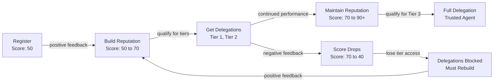

# Identity & Reputation

Iris Protocol uses **ERC-8004** for agent identity and reputation. Every AI agent that participates in the protocol must register in the IrisAgentRegistry and build reputation through the IrisReputationOracle.

## ERC-8004 Overview

ERC-8004 defines a standard for onchain agent identity and reputation. Key properties:

- Each agent mints a **lightweight identity NFT** (non-transferable)
- The identity NFT links to a reputation score maintained by an oracle
- Reputation scores are public and queryable by any contract
- Scores range from 0 to 100
- Agents are identified by `agentId` (incrementing uint256), not by address

## IrisAgentRegistry

The registry contract where agents establish their onchain identity.

### Interface

```solidity
struct AgentInfo {
    address operator;      // The address that controls the agent
    string metadataURI;    // URI pointing to off-chain metadata
    bool active;           // Whether the agent is active
    uint256 registeredAt;  // Block timestamp of registration
}

/// @notice Register a new agent identity. Caller becomes the operator.
/// @param metadataURI URI pointing to the agent's metadata
/// @return agentId The unique identifier assigned to the new agent
function registerAgent(string calldata metadataURI) external returns (uint256 agentId);

/// @notice Deactivate an agent. Only the operator may call this.
function deactivateAgent(uint256 agentId) external;

/// @notice Returns full AgentInfo for a given agent ID.
function getAgent(uint256 agentId) external view returns (AgentInfo memory);

/// @notice Returns whether an agent ID is registered and active.
function isRegistered(uint256 agentId) external view returns (bool);

/// @notice Returns the owner (operator) of the identity NFT.
function ownerOf(uint256 agentId) external view returns (address);
```

### Events

```solidity
event AgentRegistered(uint256 indexed agentId, address indexed operator, string metadataURI);
event AgentDeactivated(uint256 indexed agentId, address indexed operator);
```

### Registration Flow

```solidity
// Agent registers with metadata -- caller becomes operator
uint256 agentId = agentRegistry.registerAgent("ipfs://QmAgentMetadata...");

// Verify registration
bool registered = agentRegistry.isRegistered(agentId);
assert(registered == true);

// Get agent info
IrisAgentRegistry.AgentInfo memory info = agentRegistry.getAgent(agentId);
assert(info.operator == msg.sender);
```

## IrisReputationOracle

The oracle contract that tracks and reports agent reputation scores. Uses `Ownable` -- the oracle owner can submit feedback and add reviewers. This is the only centralization point in the protocol, intentional for reputation bootstrapping.

### Interface

```solidity
/// @notice Submit positive or negative feedback for an agent.
/// @dev Caller must be an allowed reviewer or the contract owner.
function submitFeedback(uint256 agentId, bool positive) external;

/// @notice Authorise an address to submit feedback for a given agent.
/// @dev Only the agent's operator or the contract owner may call this.
function addReviewer(uint256 agentId, address reviewer) external;

/// @notice Returns the current reputation score (0-100). Default: 50.
function getReputationScore(uint256 agentId) external view returns (uint256);

/// @notice Returns whether an address is an allowed reviewer.
function isAllowedReviewer(uint256 agentId, address reviewer) external view returns (bool);
```

### Events

```solidity
event FeedbackSubmitted(uint256 indexed agentId, address indexed reviewer, bool positive, uint256 newScore);
event ReviewerAdded(uint256 indexed agentId, address indexed reviewer);
```

### Score Mechanics

| Event Type | Impact | Details |
|------------|--------|---------|
| Positive feedback | +2 | Capped at 100. Submitted by allowed reviewers or oracle owner. |
| Negative feedback | -5 | Floored at 0. Submitted by allowed reviewers or oracle owner. |
| Default score | 50 | All agents start at 50 until first feedback. |

The asymmetric scoring (+2 / -5) means reputation is harder to build than to lose, incentivizing consistent good behavior.

## Reputation Lifecycle



### Phase 1: Registration

Every agent starts with a base score of **50**. This grants immediate eligibility for delegations that require a minimum score of 50 or below.

```solidity
uint256 agentId = agentRegistry.registerAgent("ipfs://...");
uint256 score = reputationOracle.getReputationScore(agentId);
// score == 50
```

### Phase 2: Building Reputation

Agents build reputation through positive feedback from allowed reviewers. Each positive feedback adds 2 points.

```solidity
reputationOracle.submitFeedback(agentId, true);  // 50 -> 52
reputationOracle.submitFeedback(agentId, true);  // 52 -> 54
```

### Phase 3: Getting Delegations

As reputation grows, agents qualify for delegations with higher minimum reputation requirements.

```solidity
uint256 score = reputationOracle.getReputationScore(agentId);
require(score >= 70, "Agent not qualified");
```

### Phase 4: Maintaining Reputation

Negative feedback decreases the score by 5 points per event.

```solidity
reputationOracle.submitFeedback(agentId, false);  // 70 -> 65
reputationOracle.submitFeedback(agentId, false);  // 65 -> 60
// Agent now blocked from delegations requiring score >= 70
```

## Integration with ReputationGateEnforcer

The IrisReputationOracle is queried by the [ReputationGateEnforcer](./contracts/reputation-gate.md) on every delegated execution. This creates a feedback loop:

1. Agent executes transactions via delegations
2. Transaction outcomes inform feedback submitted to the oracle
3. Reputation score determines future delegation access
4. Misbehavior automatically restricts future access

No admin key can override the enforcement loop. The ReputationGateEnforcer queries the oracle via `staticcall` and blocks execution if the score is below the delegation's configured threshold.
