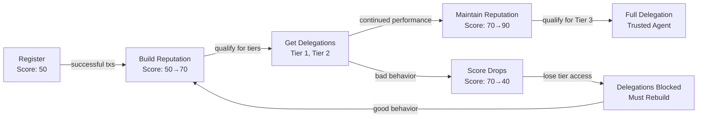

# Identity & Reputation

Iris Protocol uses **ERC-8004** for agent identity and reputation. Every AI agent that participates in the protocol must register in the IrisAgentRegistry and build reputation through the IrisReputationOracle.

## ERC-8004 Overview

ERC-8004 defines a standard for onchain agent identity and reputation. Key properties:

- Each agent mints a **non-transferable identity NFT**
- The identity NFT links to a reputation score maintained by an oracle
- Reputation scores are public and queryable by any contract
- Scores range from 0 to 100

## IrisAgentRegistry

The registry contract where agents establish their onchain identity.

### Interface

```solidity
/// @title IrisAgentRegistry
/// @notice ERC-8004 compliant agent identity registry
interface IIrisAgentRegistry {
    /// @notice Register a new agent identity
    /// @param metadata Agent metadata URI (name, description, capabilities)
    /// @return tokenId The minted identity NFT token ID
    function register(string calldata metadata) external returns (uint256 tokenId);

    /// @notice Check if an address is a registered agent
    /// @param agent The address to check
    /// @return True if the agent is registered
    function isRegistered(address agent) external view returns (bool);

    /// @notice Get the token ID for a registered agent
    /// @param agent The agent's address
    /// @return tokenId The identity NFT token ID
    function getTokenId(address agent) external view returns (uint256 tokenId);

    /// @notice Get the metadata URI for an agent
    /// @param agent The agent's address
    /// @return The metadata URI
    function getMetadata(address agent) external view returns (string memory);

    /// @notice Update agent metadata
    /// @param newMetadata The new metadata URI
    function updateMetadata(string calldata newMetadata) external;
}
```

### Events

```solidity
/// @notice Emitted when a new agent registers
event AgentRegistered(address indexed agent, uint256 indexed tokenId, string metadata);

/// @notice Emitted when agent metadata is updated
event MetadataUpdated(address indexed agent, string newMetadata);
```

### Registration Flow

```solidity
// Agent registers with metadata
uint256 tokenId = agentRegistry.register(
    "ipfs://QmAgentMetadata..."  // Name, capabilities, description
);

// Verify registration
bool registered = agentRegistry.isRegistered(agentAddress);
assert(registered == true);
```

## IrisReputationOracle

The oracle contract that tracks and reports agent reputation scores.

### Interface

```solidity
/// @title IrisReputationOracle
/// @notice Tracks and reports ERC-8004 agent reputation scores
interface IIrisReputationOracle {
    /// @notice Get the current reputation score for an agent
    /// @param agent The agent's address
    /// @return score The reputation score (0-100)
    function getScore(address agent) external view returns (uint256 score);

    /// @notice Report a positive action by an agent
    /// @param agent The agent's address
    /// @param action Encoded action descriptor
    /// @param impact Score impact (positive)
    function reportPositive(
        address agent,
        bytes calldata action,
        uint256 impact
    ) external;

    /// @notice Report a negative action by an agent
    /// @param agent The agent's address
    /// @param action Encoded action descriptor
    /// @param impact Score impact (negative)
    function reportNegative(
        address agent,
        bytes calldata action,
        uint256 impact
    ) external;

    /// @notice Get the full reputation history for an agent
    /// @param agent The agent's address
    /// @return ReputationRecord[] Array of reputation events
    function getHistory(
        address agent
    ) external view returns (ReputationRecord[] memory);
}
```

### Events

```solidity
/// @notice Emitted when reputation changes
event ReputationUpdated(
    address indexed agent,
    uint256 oldScore,
    uint256 newScore,
    bytes action
);
```

### Score Mechanics

| Event Type | Impact | Example |
|------------|--------|---------|
| Successful delegation execution | +1 to +3 | Agent completes a swap successfully |
| Failed execution (agent's fault) | -5 to -10 | Agent submits invalid calldata |
| Slashing event | -20 to -50 | Agent attempts to drain funds |
| Community report | -10 to -30 | Multiple users report bad behavior |
| Time-based decay | -1/week | Inactive agents slowly lose reputation |
| Consistent good behavior bonus | +5/month | Agents with zero negative events |

## Reputation Lifecycle



### Phase 1: Registration

Every agent starts with a base score of **50**. This grants immediate eligibility for Tier 1 delegations (minimum score: 50) but not Tier 2 (minimum: 70) or Tier 3 (minimum: 90).

```solidity
// Agent registers -- starts at score 50
agentRegistry.register("ipfs://...");
uint256 score = reputationOracle.getScore(agentAddress);
// score == 50
```

### Phase 2: Building Reputation

Agents build reputation through successful delegated executions. Each successful transaction slightly increases the score.

### Phase 3: Getting Delegations

As reputation grows, agents qualify for higher trust tiers. Users can verify an agent's reputation before granting a delegation.

```solidity
// User checks agent reputation before granting Tier 2
uint256 score = reputationOracle.getScore(agentAddress);
require(score >= 70, "Agent not qualified for Tier 2");
```

### Phase 4: Maintaining Reputation

Reputation requires maintenance. Negative events decrease the score, and inactivity causes slow decay. Agents must continue performing well to maintain high-tier access.

## Integration with ReputationGateEnforcer

The IrisReputationOracle is queried by the [ReputationGateEnforcer](./contracts/reputation-gate.md) on every delegated execution. This creates a feedback loop:

1. Agent executes transactions via delegations
2. Transaction outcomes affect reputation score
3. Reputation score determines future delegation access
4. Misbehavior automatically restricts future access

No admin key can override this loop. The protocol enforces it autonomously.
