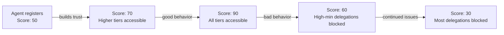

# Trust Tiers

Configurable permission levels that bundle caveat enforcers into graduated access profiles for AI agents.

Iris Protocol uses an **aperture metaphor** to describe agent permissions. Like a camera iris that opens and closes to control light, Iris Protocol opens and closes to control what an agent can do with your wallet.

## The Four Tiers

| Tier | Name | Aperture | Description |
|------|------|----------|-------------|
| 0 | View Only | Closed | Agent can read public state. No delegation granted. |
| 1 | Supervised | Narrow | Small transactions within strict guardrails. User monitors. |
| 2 | Autonomous | Wide | Larger operations with broader permissions. Agent operates independently. |
| 3 | Full Delegation | Open | Maximum autonomy with all safety mechanisms. Reserved for highly reputable agents. |

## Tier 0: View Only

**Aperture: Closed**

The agent has no delegation. It can read public blockchain state (balances, prices, positions) but cannot execute any transaction on behalf of the user.

**Use case:** Market monitoring, portfolio tracking, price alerts.

**Caveats bundled:** None (no delegation exists).

**Reputation requirement:** None.

## Tier 1: Supervised (4 Caveats)

**Aperture: Narrow**

The agent receives a tightly scoped delegation. Every transaction must pass through four caveat enforcers. Configured via `TierOne.configureTierOne()`.

**Use case:** Small swaps, DCA orders, gas-efficient rebalancing.

**Caveats bundled:**

| Enforcer | Configuration |
|----------|--------------|
| SpendingCapEnforcer | User-specified daily cap (86400s period) |
| ContractWhitelistEnforcer | Approved contract addresses only |
| TimeWindowEnforcer | Valid from now until user-specified expiry |
| ReputationGateEnforcer | User-specified minimum score |

**Example:**
```
Agent wants to deposit 3 ETH into a vault
-- SpendingCapEnforcer: 3 ETH < daily cap -- pass
-- ContractWhitelistEnforcer: vault is approved -- pass
-- TimeWindowEnforcer: within valid window -- pass
-- ReputationGateEnforcer: agent score 52 >= min 40 -- pass
-- Transaction executes
```

## Tier 2: Autonomous (5 Caveats)

**Aperture: Wide**

The agent operates with greater autonomy. Adds a per-transaction cap on top of Tier 1. Configured via `TierTwo.configureTierTwo()`.

**Use case:** Active trading, yield farming, cross-protocol operations.

**Caveats bundled:**

| Enforcer | Configuration |
|----------|--------------|
| SpendingCapEnforcer | User-specified daily cap (86400s period) |
| ContractWhitelistEnforcer | Approved contract addresses |
| TimeWindowEnforcer | Valid from now until user-specified expiry |
| ReputationGateEnforcer | User-specified minimum score |
| SingleTxCapEnforcer | User-specified max value per transaction |

**Example:**
```
Agent wants to deposit 5 ETH (maxTxValue = 10 ETH)
-- SpendingCapEnforcer: 5 ETH < daily cap -- pass
-- ContractWhitelistEnforcer: target is approved -- pass
-- TimeWindowEnforcer: within valid window -- pass
-- ReputationGateEnforcer: agent score 65 >= min 40 -- pass
-- SingleTxCapEnforcer: 5 ETH <= 10 ETH -- pass
-- Transaction executes
```

## Tier 3: Full Delegation (6 Caveats)

**Aperture: Open**

Maximum autonomy with all six safety mechanisms. Uses weekly spending caps and adds cooldown between high-value transactions. Configured via `TierThree.configureTierThree()`.

**Use case:** Trusted autonomous agents managing complex multi-step strategies with proven track records.

**Caveats bundled:**

| Enforcer | Configuration |
|----------|--------------|
| SpendingCapEnforcer | User-specified **weekly** cap (604800s period) |
| ContractWhitelistEnforcer | Approved contract addresses |
| TimeWindowEnforcer | Valid from now until user-specified expiry |
| ReputationGateEnforcer | User-specified minimum score (typically higher) |
| SingleTxCapEnforcer | User-specified max value per transaction |
| CooldownEnforcer | Minimum delay between high-value transactions |

**Example:**
```
Agent executes a 15 ETH transaction (cooldown threshold = 10 ETH)
-- All 6 enforcers pass -- transaction executes
-- Cooldown timer starts

Agent attempts 12 ETH transaction immediately
-- CooldownEnforcer: cooldown not elapsed -- BLOCKED

After cooldown period:
-- Agent retries 12 ETH -- all enforcers pass
-- Transaction executes

Low-value transaction (5 ETH, below threshold):
-- CooldownEnforcer: value < threshold -- bypasses cooldown
-- Transaction executes immediately
```

## How Reputation Affects Tier Access

Reputation is not static. The **ReputationGateEnforcer** checks the agent's ERC-8004 reputation score at execution time, not at delegation time. This means:

1. An agent granted a delegation can be **dynamically blocked** if their reputation drops
2. Reputation checks happen on every transaction
3. The network acts as an **immune system** -- misbehaving agents lose access across all delegations



## Choosing the Right Tier

| Scenario | Recommended Tier |
|----------|-----------------|
| I want my agent to track prices and alert me | Tier 0 |
| I want my agent to make small trades I can review | Tier 1 |
| I want my agent to manage a portion of my portfolio | Tier 2 |
| I fully trust this agent with proven track record | Tier 3 |
| I am not sure | Start with Tier 0, upgrade after monitoring |

## Custom Caveat Bundles

Trust tiers are presets. You can also create custom delegations by combining any set of caveat enforcers. See [Tier Presets](./contracts/tier-presets.md) for preset configurations and [Caveat Enforcers](./contracts/caveat-enforcers.md) for the full enforcer catalog.
