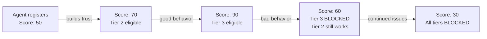

# Trust Tiers

Iris uses an **aperture metaphor** to describe agent permissions. Like a camera iris that opens and closes to control light, Iris Protocol opens and closes to control what an agent can do with your wallet.

## The Four Tiers

| Tier | Name | Aperture | Description |
|------|------|----------|-------------|
| 0 | View Only | Closed | Agent can read public state. No delegation granted. |
| 1 | Supervised | Narrow | Small transactions within strict guardrails. User monitors. |
| 2 | Autonomous | Wide | Larger operations with broader permissions. Agent operates independently. |
| 3 | Full Delegation | Open | Near-complete access. Reserved for highly reputable agents. |

## Tier 0: View Only

**Aperture: Closed**

The agent has no delegation. It can read public blockchain state (balances, prices, positions) but cannot execute any transaction on behalf of the user.

**Use case:** Market monitoring, portfolio tracking, price alerts.

**Caveats bundled:** None (no delegation exists).

**Reputation requirement:** None.

## Tier 1: Supervised

**Aperture: Narrow**

The agent receives a tightly scoped delegation. Every transaction must pass through multiple caveat enforcers. The user is expected to monitor agent activity.

**Use case:** Small swaps, DCA orders, gas-efficient rebalancing under $100/day.

**Caveats bundled:**

| Enforcer | Configuration |
|----------|--------------|
| SpendingCapEnforcer | $100/day limit |
| SingleTxCapEnforcer | $50 max per transaction |
| ContractWhitelistEnforcer | Approved DEX routers only |
| FunctionSelectorEnforcer | `swap()`, `transfer()` only |
| TimeWindowEnforcer | Active hours only (configurable) |
| ReputationGateEnforcer | Minimum score: 50 |

**Example:**
```
Agent wants to swap 0.02 ETH ($50) on Uniswap
→ SpendingCapEnforcer: $50 < $100 daily limit ✅
→ SingleTxCapEnforcer: $50 <= $50 cap ✅
→ ContractWhitelistEnforcer: Uniswap Router is approved ✅
→ FunctionSelectorEnforcer: swap() is allowed ✅
→ TimeWindowEnforcer: within active window ✅
→ ReputationGateEnforcer: agent score 72 >= 50 ✅
→ Transaction executes
```

## Tier 2: Autonomous

**Aperture: Wide**

The agent operates with significant autonomy. Higher spending limits, broader contract access, and fewer restrictions. The agent is trusted to operate independently but with guardrails on maximum exposure.

**Use case:** Active trading, yield farming, cross-protocol operations up to $1,000/day.

**Caveats bundled:**

| Enforcer | Configuration |
|----------|--------------|
| SpendingCapEnforcer | $1,000/day limit |
| SingleTxCapEnforcer | $500 max per transaction |
| FunctionSelectorEnforcer | Broader function whitelist |
| CooldownEnforcer | 5-minute minimum between transactions over $200 |
| ReputationGateEnforcer | Minimum score: 70 |

**Example:**
```
Agent wants to deposit $400 into Aave lending pool
→ SpendingCapEnforcer: $400 < $1,000 daily limit ✅
→ SingleTxCapEnforcer: $400 <= $500 cap ✅
→ FunctionSelectorEnforcer: deposit() is allowed ✅
→ CooldownEnforcer: last large tx was 10 min ago ✅
→ ReputationGateEnforcer: agent score 85 >= 70 ✅
→ Transaction executes
```

## Tier 3: Full Delegation

**Aperture: Open**

Near-complete delegation. The agent can execute most operations without fine-grained restrictions. The only gating mechanism is reputation: only agents with exceptional track records qualify.

**Use case:** Trusted autonomous agents managing complex multi-step strategies. The agent has earned extensive trust through onchain history.

**Caveats bundled:**

| Enforcer | Configuration |
|----------|--------------|
| ReputationGateEnforcer | Minimum score: 90 |

**Example:**
```
Agent wants to execute a complex arbitrage across 3 protocols
→ ReputationGateEnforcer: agent score 95 >= 90 ✅
→ Transaction executes

Later, agent's reputation drops to 85 after a failed strategy:
→ ReputationGateEnforcer: agent score 85 < 90 ❌
→ Transaction REVERTS -- agent automatically downgraded
```

## How Reputation Affects Tier Access

Reputation is not static. The **ReputationGateEnforcer** checks the agent's ERC-8004 reputation score at execution time, not at delegation time. This means:

1. An agent granted Tier 3 can be **dynamically downgraded** if their reputation drops
2. Reputation checks happen on every transaction, not just at delegation creation
3. The network acts as an **immune system** -- misbehaving agents lose access across all delegations



## Choosing the Right Tier

| Scenario | Recommended Tier |
|----------|-----------------|
| I want my agent to track prices and alert me | Tier 0 |
| I want my agent to make small trades I can review | Tier 1 |
| I want my agent to manage a portion of my portfolio | Tier 2 |
| I fully trust this agent with proven track record | Tier 3 |
| I am not sure | Start with Tier 0, upgrade after monitoring |

## Custom Caveat Bundles

Trust tiers are presets. You can also create custom delegations by combining any set of caveat enforcers. See [Tier Presets](./contracts/tier-presets.md) for preset configurations and [Caveat Enforcers](./contracts/caveat-enforcers.md) for the full enforcer catalog.
